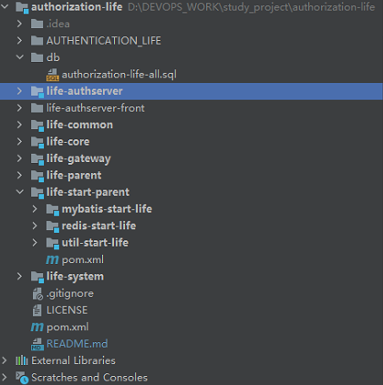
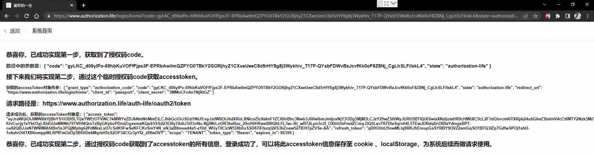

# authorization-life ：鉴权的一生

## 前后端分离Oauth2.0的实践

### 自定义maven工程 与 spring-security + spring-authorization-server 深度整合实践。

## 公共模块：

### life-parent
#### 管理所有模块的公共依赖，主要包含 lombok、hutool、guava、等springboot工程中默认需要的组件。
### life-common
#### 管理web服务、注册组件、工具类的公共依赖，如果某一个服务需要作为web服务进行与前端做交互，则需要引入此依赖。
### life-core
#### 管理公共的认证配置、jwt的解析、服务上下线的注册、服务的启动和停止的配置、等对于每一个服务所需的公共配置信息。
### life-start-parent
#### 管理 mybatis-plus、redis、util工具包、等可以自行发挥想象，定义所需的start。

## 认证授权中心(oauth2.0中的server端)：

### life-authserver
#### 集成spring-security、spring-authorization-server 深度整合Oauth2.0的模块，作为认证和授权服务，将认证用户和颁发token。

## 网关：

### life-gateway
#### 服务上下线的监听(动态路由的实现)，Authorization 的解析、校验权限，自定义路由，url路径的校验，gateway断路器的配置， 等一些可以在网关层次做的操作。

## 系统设置服务(oauth2.0中的client端)：

### life-system
#### 系统中的字典、业务配置、系统的默认参数、等等，需要产品的具体的需求。

## 前端工程
#### 后端springboot服务与前端vue服务是一一对应的。相当于系统中的某一个模块，模块的请求网址路径就是vue工程的baseUrl，后端请求的路径将直接请求网关gateway，网关会根据请求路径的不一致进行路由分发，从而获取数据信息。
### life-authserver-front
#### 认证授权中心的前端工程，用于登录的认证和授权。

### 使用的框架技术：
后端：

    spring-boot 2.7.3

    spring-cloud 2021.0.3

    spring-cloud-alibaba 2.2.8.RELEASE

    spring-security 5.7.3

    spring-security-oauth2-authorization-server 0.3.1

前端：
    
    vue2.0

## 工程结构图：

## Oauth2.0的授权模式的概念

### 授权的四种方式

    https://www.ruanyifeng.com/blog/2019/04/oauth-grant-types.html

### 授权方式的图解

    https://learnku.com/articles/20082

### 实践Oauth2.0前后端分离两个步骤

#### 1、spring-boot 与 spring-security 集成 
参考：

    https://blog.csdn.net/xiaokanfuchen86/article/details/109002266

    https://blog.csdn.net/qq_43799161/article/details/123854833

#### 2、spring-boot 与 spring-security 、oauth2-authorization-server 、 spring-cloud-gateway 集成
参考：

    https://github.com/spring-projects/spring-authorization-server

    https://blog.51cto.com/u_14558366/5605065

## 此工程对应的博客专栏

    https://blog.csdn.net/qq_38046739/category_12090398.html

## 授权码模式

### 博文：

    https://blog.csdn.net/qq_38046739/article/details/127752149

### 流程：

    1、访问 https://www.authorization.life ， 将跳转到 https://www.authorization.life/login 登录页面。
    2、输入用户名密码
        用户名：qjyn1314@163.com
        密码：admin
    3、用户名密码验证通过之后，将重定向到：https://www.authorization.life/login/home?code=gyLKC_d06yIPo-69hbKuVOFfFjps3F-EPRbAwilmQZPYO0TBkY2GORjhyZ1CXxeUeeC8d5rHY8g8j3Wykhiv_T17P-QYsbFDWvBzJcvfKk0oF8Z8Nj_CgLhSLFiIskL4&state=authorization-life
    4、login-front前端工程中的 home 页面中做一些操作，通过 网址中的 code 请求 /oauth2/token 接口 ，获取自定义的 jwt形式的 accessToken，然后将其保存到cookie中，为下一次请求接口使用。
### 结果：

